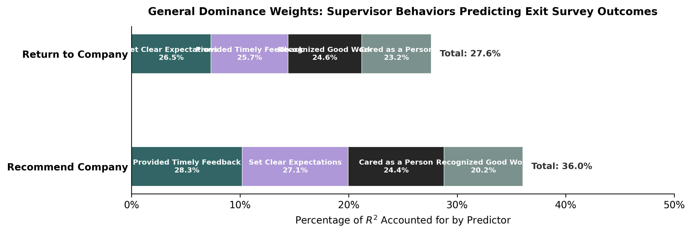
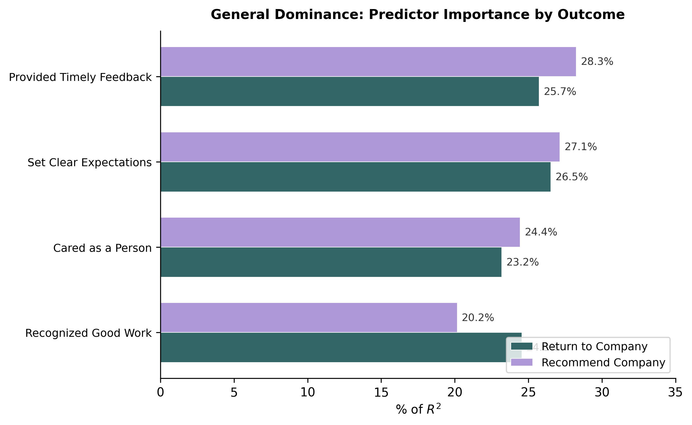
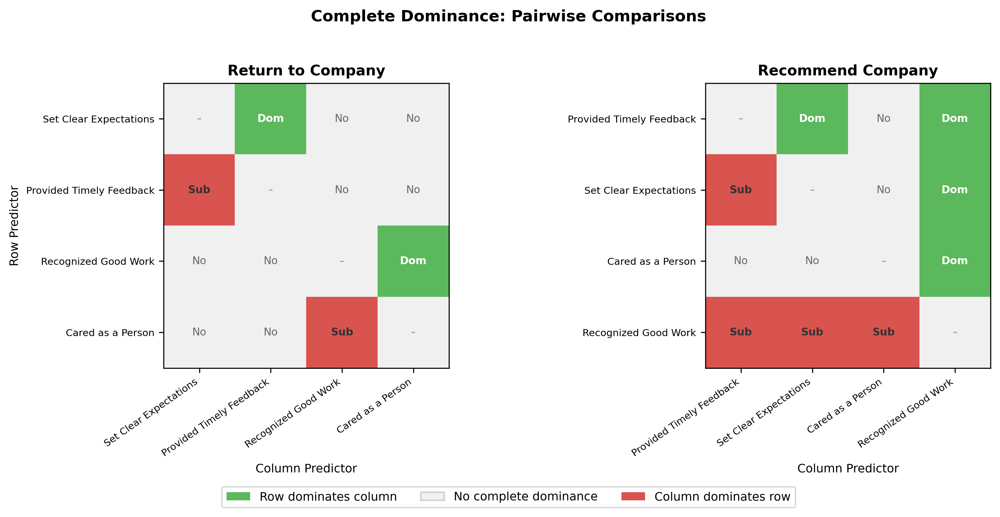

# What Drives Company Brand Strength? Insights from Exit Surveys

## Key Takeaway

**Managers who set clear expectations and provide timely feedback have the greatest influence on whether departing employees would recommend or return to the company.** These two behaviors consistently outperform recognition and personal caring in shaping how exiting employees view the organization.

---

## Background

We analyzed exit survey responses from **825 departing employees** to understand which supervisor behaviors most influence two critical outcomes:

- **Would you recommend this company as a place to work?**
- **Would you consider returning to this company in the future?**

Employees rated four supervisor behaviors on a 1-5 scale:

| Supervisor Behavior | Average Rating |
|---|---|
| Set clear expectations | 3.5 |
| Provided timely feedback | 3.4 |
| Recognized good work | 3.5 |
| Cared for me as a person | 3.4 |

---

## What We Found

### Supervisor behaviors explain more of why people recommend than why they return

The four supervisor behaviors account for **36% of the variation** in whether someone would recommend the company, but only **28%** for whether they would return. This means supervisor quality has a stronger link to external reputation (recommendations to others) than to personal re-employment decisions.

### The most important behaviors are clear expectations and timely feedback

Across both outcomes, **setting clear expectations** and **providing timely feedback** consistently account for the largest share of influence. Together, these two behaviors represent over half of the total explained variation for each outcome.

| Supervisor Behavior | Share of Influence: Recommend | Share of Influence: Return |
|---|---|---|
| **Provided timely feedback** | **28.3%** | 25.7% |
| **Set clear expectations** | **27.1%** | **26.5%** |
| Cared as a person | 24.4% | 23.2% |
| Recognized good work | 20.2% | 24.6% |

### How the ranking shifts between the two outcomes

- For **Recommend**, feedback edges out expectations as the top driver, and recognition drops to a clear last place.
- For **Return**, the four behaviors are more evenly weighted, though expectations still leads.

### Some behaviors are definitively more important than others

We tested whether each behavior's advantage holds up under every possible comparison scenario. The strongest findings:

- **Feedback always outperforms expectations** when predicting recommendations (and vice versa for return).
- **Recognition is consistently the weakest predictor** of recommendations, falling behind all three other behaviors in every comparison tested.
- For the return outcome, most pairs are too close to call definitively.

---

## What This Means for the Business

### Invest in manager capability around expectations and feedback

The data suggest that organizations looking to improve their reputation among departing employees, and by extension on platforms like Glassdoor, should prioritize developing managers in two specific areas:

1. **Setting clear expectations** - Ensuring employees understand what is expected of them in their role
2. **Providing timely feedback** - Giving employees regular, prompt input on their performance

### This matters more for external reputation than for rehires

Because these behaviors have a stronger link to recommendations than to return intent, improvements here are more likely to show up as better employer brand perception (word-of-mouth, review sites) than as increased boomerang hires.

### Recognition and caring still matter, but less so

While all four supervisor behaviors contribute meaningfully, recognition and personal caring are secondary drivers. They should not be neglected, but in a resource-constrained environment, the highest return on investment comes from expectations and feedback.

---

## About the Analysis

This analysis used **dominance analysis** (Budescu, 1993), a method that determines the relative importance of predictors by examining every possible combination of factors. Unlike simpler approaches, it accounts for overlap between related behaviors and produces a reliable ranking even when predictors are correlated with each other, as supervisor behaviors tend to be.

Results were cross-validated with a second statistical method (relative weights analysis) and produced identical rankings, increasing confidence in the findings.

*N = 825 exit survey respondents | 4 supervisor behavior predictors | 2 outcome measures*
